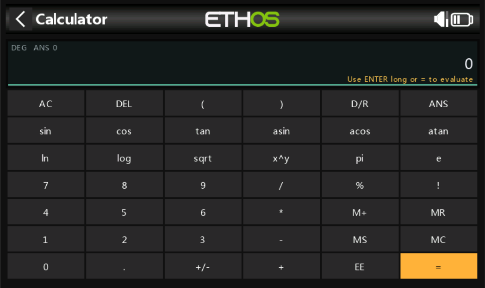

# Ethos Calculator

A compact scientific calculator for FrSky Ethos radios and the Ethos simulator.
It runs as an Ethos System Tool, so it is available directly on the radio when
you need quick field math, setup checks, or unit calculations.



## Highlights

- Standard math with parentheses: `+`, `-`, `*`, `/`, and `^`
- Scientific functions: `sin`, `cos`, `tan`, `asin`, `acos`, `atan`, `sqrt`,
  `ln`, and `log`
- Constants and saved values: `pi`, `e`, `ans`, and memory register `m`
- Percent and factorial postfix operators: `%` and `!`
- Degree/radian toggle with the `D/R` key
- Scientific notation entry with `EE`, such as `1e6`
- Memory keys: `MS`, `MR`, `M+`, and `MC`
- Implicit multiplication for natural entries like `2pi`, `2(3+4)`, and
  `2sin(30)`

## Installation

Copy the `calculator` folder to the `scripts` folder on your radio SD card or
simulator root:

```text
scripts/calculator/main.lua
scripts/calculator/gfx/icon.png
```

Keep `main.lua` and the `gfx` folder together.

The tool will appear as "Calculator" in the system menu.

## Basic Use

- Tap the on-screen keys to build an expression.
- Tap `=` or long-press `ENTER` to evaluate.
- Use `DEL` to remove the last character.
- Use `AC` to clear the current expression.
- Use `D/R` to switch trigonometry between degrees and radians.
- Use `ANS` to insert the previous result into the next expression.

The top line shows the current angle mode, the last answer, and memory value
when memory is set.

## Memory Keys

- `MS` stores the current value in memory.
- `MR` inserts the memory value into the expression.
- `M+` adds the current value to memory.
- `MC` clears memory.

Memory can also be referenced in expressions with `m` or `mem`.

## Examples

```text
2pi          -> 2 * pi
2(3+4)       -> 14
2sin(30)     -> 1 in degree mode
sqrt(144)    -> 12
5!           -> 120
250%         -> 2.5
1.2e6        -> 1200000
ans/2        -> half of the previous answer
```

## Notes

Input is limited to 160 characters to keep the calculator responsive on the
radio. Very large results, deeply nested expressions, division by zero, and
invalid function inputs show an error message instead of locking up the tool.

For very large or very small numbers, use `EE` scientific notation.

## Troubleshooting

If the calculator does not show up, confirm the folder is named `calculator`
and is placed directly under `scripts`. The final path should include:

```text
scripts/calculator/main.lua
```

If the icon is missing but the calculator opens, check that this file was copied:

```text
scripts/calculator/gfx/icon.png
```


## Other

Graphics by Pixel Perfect
https://www.flaticon.com/free-icon/keys_2891382
