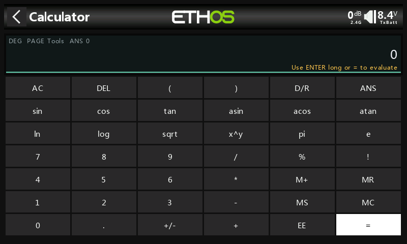
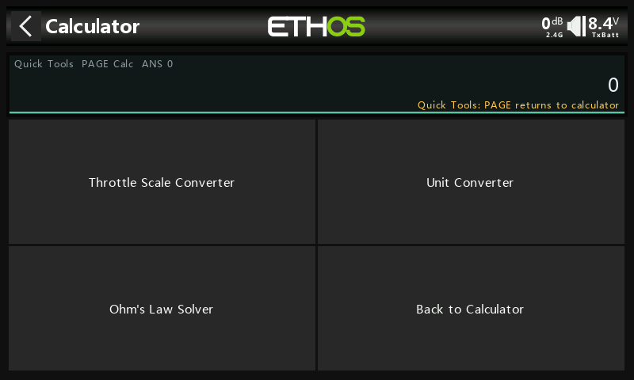
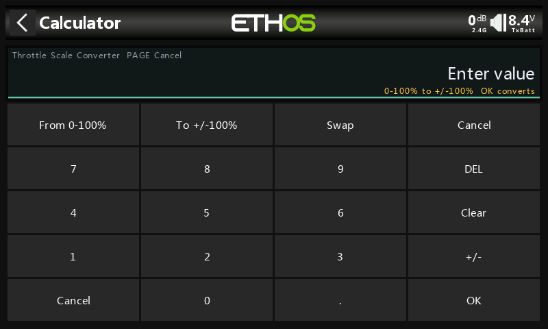
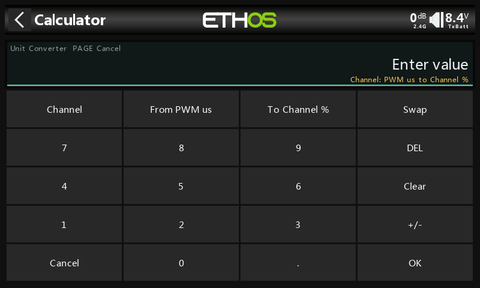
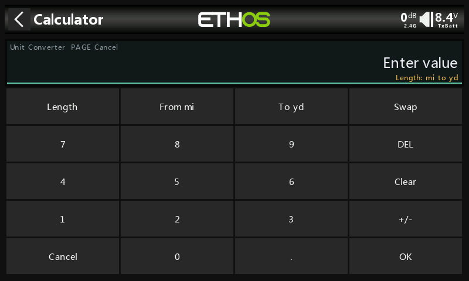
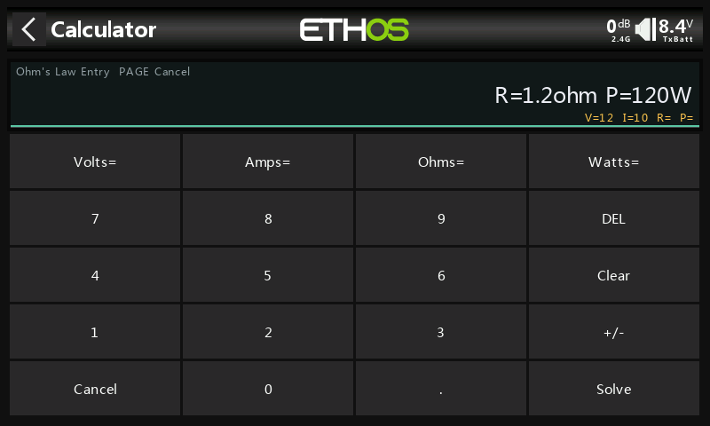

# Ethos Calculator

A compact scientific calculator for FrSky Ethos radios and the Ethos simulator.
It runs as an Ethos System Tool, so it is available directly on the radio when
you need quick field math, setup checks, or unit calculations.



## Highlights

- Standard math with parentheses: `+`, `-`, `*`, `/`, and `^`
- Scientific functions: `sin`, `cos`, `tan`, `asin`, `acos`, `atan`, `sqrt`,
  `ln`, and `log`
- Constants and saved values: `pi`, `e`, `ans`, and memory register `m`
- Percent and factorial postfix operators: `%` and `!`
- Degree/radian toggle with the `D/R` key
- Scientific notation entry with `EE`, such as `1e6`
- Memory keys: `MS`, `MR`, `M+`, and `MC`
- Implicit multiplication for natural entries like `2pi`, `2(3+4)`, and
  `2sin(30)`
- Quick Tools mode from the radio `PAGE` key for throttle conversion, unit
  conversion, and Ohm's Law

## Installation

Copy the `calculator` folder to the `scripts` folder on your radio SD card or
simulator root:

```text
scripts/calculator/main.lua
scripts/calculator/gfx/icon.png
```

Keep `main.lua` and the `gfx` folder together.

The tool will appear as "Calculator" in the system menu.

## Basic Use

- Tap the on-screen keys to build an expression.
- Tap `=` or long-press `ENTER` to evaluate.
- Use `DEL` to remove the last character.
- Use `AC` to clear the current expression.
- Use `D/R` to switch trigonometry between degrees and radians.
- Use `ANS` to insert the previous result into the next expression.
- Press the radio `PAGE` key to switch between the calculator and Quick Tools.
- Press `RTN` to go back from a Quick Tools entry page to the Quick Tools menu,
  or from the Quick Tools menu back to the calculator.

The top line shows the current mode, `PAGE` hint, last answer, and memory value
when memory is set.

## Memory Keys

- `MS` stores the current value in memory.
- `MR` inserts the memory value into the expression.
- `M+` adds the current value to memory.
- `MC` clears memory.

Memory can also be referenced in expressions with `m` or `mem`.

## Quick Tools

Press `PAGE` to switch to Quick Tools, then tap a tool. Each tool opens an entry
prompt with its own keypad. Enter the source value or values and tap `OK` or
`Solve`. Tools stay on their entry page for repeated conversions until you tap
`Cancel` or press `RTN`/`PAGE`. The result replaces the current calculator entry
and is also stored as `ans` where practical.



Available Quick Tools:

### Throttle Scale Converter



Converts between Spektrum-style `0-100%` throttle values and Ethos/EdgeTX-style
`+/-100%` throttle values. Use the `Swap` button to flip the direction.

Examples:

```text
0-100% to +/-100%: 75 -> +50
+/-100% to 0-100%: +50 -> 75
```

### Unit Converter





Converts within a selected unit group. Tap the group selector to switch between
channel, length, weight, and temperature. Tap either unit selector to cycle that
side through the units in the selected group.  Tapping `Swap` will swap the
`From` and `To` units.

Unit Converter groups:

- Channel: `PWM us`, `Channel %`
- Length: `mi`, `yd`, `ft`, `in`, `km`, `m`, `cm`, `mm`
- Weight: `kg`, `g`, `mg`, `lb`, `oz`
- Temperature: `degC`, `degF`, `Kelvin`

Channel conversions reject source entries outside `800` to `2200` PWM us or
outside `-125` to `+125` channel percent.

### Ohm's Law Solver



Solves the remaining Ohm's Law values from any two entered values. Tap a
parameter (`Volts`, `Amps`, `Ohms`, or `Watts`), enter its value, then tap
another parameter and enter its value. Entered values appear in the status line below the main
display as you enter them. Tap `Solve` to calculate the remaining two values.

The same conversions can be typed directly:

```text
thr_ethos(75)       -> +50
thr_spektrum(50)   -> 75
pwm_pct(1500)      -> 0
pct_pwm(-100)      -> 1000
in_mm(5)           -> 127
mm_in(25.4)        -> 1
oz_g(1)            -> 28.34952
g_oz(28.349523125) -> 1
```

Ohm's Law examples:

```text
12 V and 2 A     -> R = 6 ohm, P = 24 W
12 V and 6 ohm   -> I = 2 A, P = 24 W
6 ohm and 24 W   -> V = 12 V, I = 2 A
```

## Examples

```text
2pi          -> 2 * pi
2(3+4)       -> 14
2sin(30)     -> 1 in degree mode
sqrt(144)    -> 12
5!           -> 120
250%         -> 2.5
1.2e6        -> 1200000
ans/2        -> half of the previous answer
```

## Other

Graphics by Pixel Perfect
https://www.flaticon.com/free-icon/keys_2891382
